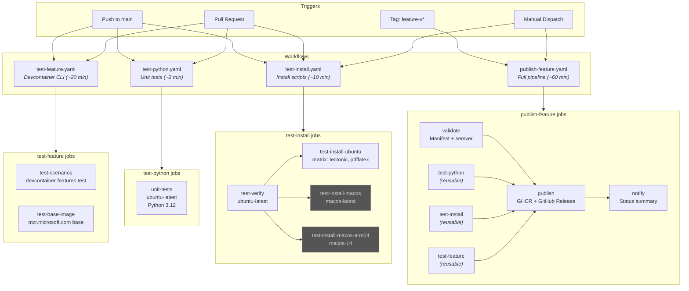

# Maintainer Guide

This guide covers CI/CD workflows, testing infrastructure, and operational details for maintainers of the CoSAI Whitepaper Converter.

## CI/CD Pipeline Overview



## Workflow Details

### test-python.yaml

Runs Python unit tests. The fastest workflow (~2 min).

| Field | Value |
|-------|-------|
| **Triggers** | Push to `main` (path-filtered), pull requests, `workflow_call` |
| **Path filters** | `convert.py`, `tests/**`, `assets/*.sty`, `assets/*.tex`, `pyproject.toml`, `requirements.txt` |
| **Jobs** | 1: `unit-tests` (ubuntu-latest, Python 3.12) |
| **Command** | `pytest tests/unit/ --tb=short -q` |

### test-install.yaml

Validates install and verify scripts on clean systems.

| Field | Value |
|-------|-------|
| **Triggers** | Push to `main` (path-filtered), pull requests, `workflow_dispatch`, `workflow_call` |
| **Path filters** | `scripts/**`, `.github/workflows/test-install.yaml` |
| **Jobs** | 2 default + 2 optional (macOS) |

**Jobs:**

| Job | Runner | Purpose |
|-----|--------|---------|
| `test-verify` | ubuntu-latest | Confirms `verify-deps.sh` detects missing deps |
| `test-install-ubuntu` | ubuntu-latest | Matrix: `[tectonic, pdflatex]` — full install + convert test |
| `test-install-macos` | macos-latest | macOS Intel install (opt-in, see [Flags](#flags)) |
| `test-install-macos-arm64` | macos-14 | macOS ARM64 install (opt-in, see [Flags](#flags)) |

### test-feature.yaml

Tests the devcontainer feature using the official `devcontainer features test` CLI.

| Field | Value |
|-------|-------|
| **Triggers** | Push to `main` (path-filtered), pull requests, `workflow_call` |
| **Path filters** | `src/**`, `test/**`, `convert.py`, `assets/**` |
| **Jobs** | 2: `test-scenarios`, `test-base-image` |

**Scenarios** (defined in `test/whitepaper-converter/scenarios.json`):

| Scenario | Script | What it tests |
|----------|--------|---------------|
| Default | `test.sh` | Full install with tectonic (default engine) |
| pdflatex | `pdflatex.sh` | TeX Live pdflatex engine |
| skip_python | `skip_python.sh` | `skipPython: true` flag |
| minimal | `minimal.sh` | All skip flags combined |

### publish-feature.yaml

Full release pipeline. Runs all tests, then publishes to GHCR.

| Field | Value |
|-------|-------|
| **Triggers** | Tag push `feature-v*`, `workflow_dispatch` (with `dry_run` option) |
| **Jobs** | 6: validate, test-python, test-install, test-feature, publish, notify |
| **Permissions** | `contents: write`, `packages: write` |

**Publish steps:**
1. Validates manifest version matches git tag (semver)
2. Runs all three test workflows (reusable `workflow_call`)
3. Bundles scripts + converter into feature package
4. Publishes to `ghcr.io` via `devcontainers/action@v1`
5. Creates GitHub Release with usage examples
6. Reports final status (success/failure summary)

## Flags

### macOS Tests (`test-install.yaml`)

macOS install tests are **disabled by default** to save CI minutes (~30 min each). Enable them via any of:

| Method | How |
|--------|-----|
| **PR label** | Add the `test-macos` label to a pull request |
| **Manual dispatch** | Actions → "Run workflow" → check "Run macOS install tests" |
| **Caller workflow** | Pass `run_macos: true` via `workflow_call` input |

### Publish Dry Run (`publish-feature.yaml`)

| Method | How |
|--------|-----|
| **Manual dispatch** | Actions → "Run workflow" → check "Skip actual publish (dry run)" |

### Install Script Flags

Environment variables for `scripts/install-deps.sh`:

| Variable | Default | Purpose |
|----------|---------|---------|
| `LATEX_ENGINE` | `tectonic` | LaTeX engine: `tectonic`, `pdflatex`, `xelatex`, `lualatex` |
| `SKIP_PYTHON` | `false` | Skip Python 3.12 installation |
| `SKIP_NODE` | `false` | Skip Node.js 22 LTS installation |
| `SKIP_CHROMIUM` | `false` | Skip Chromium configuration |
| `_TEST_EUID` | *(unset)* | Override `EUID` for testing `check_sudo()` in root containers |

## Dependency Versions

Versions actually installed by `scripts/install-deps.sh`:

| Dependency | Installed Version | Minimum Enforced | Enforced By |
|------------|-------------------|------------------|-------------|
| Python | 3.12.x | 3.12+ | `verify-deps.sh` |
| Node.js | 22 LTS (via NodeSource `setup_22.x`) | 18+ | `verify-deps.sh` |
| Pandoc | 3.9 (from GitHub releases) | 3.9+ | `verify-deps.sh` |
| Tectonic | 0.15.0 (from GitHub releases) | any | `verify-deps.sh` (presence only) |
| Mermaid CLI | ^11.12.0 (`package.json`) | any | `verify-deps.sh` (presence only) |
| python-frontmatter | 1.1.0 (`requirements.txt`) | any | `verify-deps.sh` (presence only) |

**Why Pandoc 3.9?** Pandoc 3.9 adds the `+alerts` extension for native GFM callout support (`> [!NOTE]` syntax). Additionally, 3.8.2.1 fixed a table counter bug where `\def\LTcaptype{}` broke the `caption` LaTeX package ("No counter '' defined") — see [jgm/pandoc#11201](https://github.com/jgm/pandoc/issues/11201).

## Concurrency & Deduplication

All test workflows use this pattern to prevent duplicate runs:

```yaml
# Push events: only on main (prevents push+PR double-trigger)
on:
  push:
    branches: [main]
  pull_request:  # all branches

# Concurrency: cancels stale runs on rapid pushes
concurrency:
  group: ${{ github.workflow }}-${{ github.event.pull_request.number || github.ref }}
  cancel-in-progress: true
```

## Bundling Architecture

The devcontainer feature requires scripts and converter files to be self-contained in `src/whitepaper-converter/`. Since we don't want duplicated files in git, bundling happens at CI build time via a composite action.

**Composite action**: `.github/actions/bundle-feature/action.yaml`

Used by: `test-feature.yaml`, `publish-feature.yaml`

```
Repository (git)                    Built Package (GHCR)
├── scripts/                        src/whitepaper-converter/
│   ├── install-deps.sh      ──►     ├── scripts/
│   ├── verify-deps.sh               │   ├── install-deps.sh
│   └── configure-chromium.sh        │   ├── verify-deps.sh
├── convert.py               ──►     │   └── configure-chromium.sh
├── requirements.txt                  ├── converter/
├── package.json                      │   ├── convert.py
└── assets/                           │   ├── requirements.txt
    ├── config.json          ──►      │   ├── package.json
    ├── cosai-template.tex            │   └── assets/ (7 files)
    ├── cosai.sty                     ├── install.sh
    ├── cosai-logo.png                └── devcontainer-feature.json
    ├── background.pdf
    └── CoSAI(Light).pdf
```

## Local Testing

### Unit Tests

```bash
# All unit tests
pytest tests/unit/ -v --tb=short

# Single test file
pytest tests/unit/test_convert.py

# Single test
pytest tests/unit/test_convert.py::test_function_name

# With coverage
pytest --cov=. --cov-report=term-missing
```

### CI Workflows via `act`

[`act`](https://github.com/nektos/act) runs GitHub Actions locally in Docker.

```bash
# test-python (works fully)
act -W .github/workflows/test-python.yaml --detect-event

# test-install: verify + ubuntu matrix (works fully)
act -W .github/workflows/test-install.yaml -j test-verify --detect-event
act -W .github/workflows/test-install.yaml -j test-install-ubuntu --detect-event --matrix engine:tectonic
act -W .github/workflows/test-install.yaml -j test-install-ubuntu --detect-event --matrix engine:pdflatex
```

**Known limitation:** `test-feature.yaml` cannot be fully validated via `act`. The `devcontainer features test` command creates temp directories inside the act container, but the host Docker daemon can't bind-mount them (Docker-in-Docker path mismatch). The feature builds and installs succeed, but container launch fails. Validate this workflow on GitHub Actions.

### Devcontainer Feature Tests (Direct)

If running outside `act` in a DinD-capable environment:

```bash
# Bundle first (required)
mkdir -p src/whitepaper-converter/scripts src/whitepaper-converter/converter/assets
cp scripts/*.sh src/whitepaper-converter/scripts/
cp convert.py src/whitepaper-converter/converter/
cp assets/{config.json,puppeteerConfig.json.orig,cosai-template.tex,cosai.sty,cosai-logo.png,background.pdf,"CoSAI(Light).pdf"} src/whitepaper-converter/converter/assets/
cp requirements.txt package.json src/whitepaper-converter/converter/

# Run tests
devcontainer features test -f whitepaper-converter --skip-autogenerated --skip-duplicated .
```

### Docker Cleanup

Feature tests create large images (~5-11 GB each). Clean up between runs:

```bash
docker system prune -af --volumes
```

## Exit Codes (`install-deps.sh`)

| Code | Meaning |
|------|---------|
| 0 | Success |
| 1 | General error |
| 2 | Unsupported platform (Windows) |
| 3 | Missing sudo (when needed on Linux) |
| 4 | Network error |
| 5 | Verification failed (post-install `verify-deps.sh` check) |

## Releasing a New Feature Version

1. Update version in `src/whitepaper-converter/devcontainer-feature.json`
2. Push a tag: `git tag feature-v0.2.8 && git push origin feature-v0.2.8`
3. `publish-feature.yaml` runs automatically: validate → test → publish → notify
4. Verify at `ghcr.io/cosai-oasis/cosai-whitepaper-converter/whitepaper-converter`

For a dry run without publishing:
- Actions → `publish-feature.yaml` → "Run workflow" → check "dry_run"
